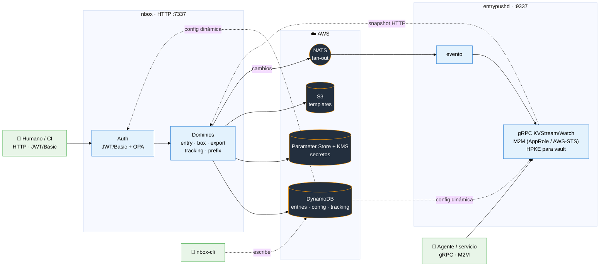

# NBOX: Gestión Centralizada de Configuraciones y Secretos

NBOX es un servicio backend escrito en Go, diseñado para actuar como una solución centralizada y segura para la administración de variables de entorno, secretos y plantillas de configuración en entornos de desarrollo modernos.

## Tabla de contenidos

- [Características Principales](#características-principales)
- [Componentes](#componentes)
- [Guía de Inicio Rápido](#guía-de-inicio-rápido)
  - [Prerrequisitos](#prerrequisitos)
  - [Instalación y Ejecución Local](#instalación-y-ejecución-local)
- [Referencia de la API](#referencia-de-la-api)
  - [Autenticación](#autenticación)
  - [Gestión de Variables (Entries)](#gestión-de-variables-entries)
  - [Gestión de Plantillas (Templates)](#gestión-de-plantillas-templates)
  - [Configuración](#configuración)
  - [Desarrollo](#desarrollo)
- [CLI de administración (`nbox-cli`)](#cli-de-administración-nbox-cli)
- [Deployment](#deployment)
- [Arquitectura](#arquitectura)
- [Project Structure](#project-structure)
- [Security playground](#security-playground)
- [Agentes M2M (entrypushd gRPC)](#agentes-m2m-entrypushd-grpc)
- [TODO](#todo)

---

## Características Principales

-   **Almacén Centralizado**: Gestiona variables y secretos para múltiples servicios y entornos (desarrollo, QA, producción) desde un único lugar.
-   **Integración Nativa con AWS**:
  -   **Variables**: Almacenadas en **AWS DynamoDB**, con historial de cambios para auditoría.
  -   **Secretos**: Guardados de forma segura en **AWS Parameter Store** utilizando una clave de cifrado propia de **AWS KMS**.
  -   **Plantillas**: Versionadas y almacenadas en **AWS S3** (por ejemplo, definiciones de tareas de ECS, archivos de configuración, etc.).
-   **Procesamiento Dinámico de Plantillas**: Reemplaza variables (`{{...}}`) y marcadores de posición (`:...`) dentro de las plantillas al momento de solicitarlas, permitiendo la generación de configuraciones dinámicas.
-   **Seguridad Robusta**:
  -   **Autenticación**: Soporta tanto **HTTP Basic Auth** como **JWT** para proteger los endpoints.
  -   **Autorización**: Utiliza **Open Policy Agent (OPA)** para un control de acceso granular y basado en roles.

---

## Componentes

NBOX se compone de **dos servicios** y una **CLI** de administración:

| Componente | Qué es | Puerto |
|---|---|---|
| **`nbox`** | Microservicio HTTP: API REST de entries, templates (box), export, tracking y auth (JWT/Basic + OPA). | `7337` |
| **`entrypushd`** | Subscriber NATS + servidor gRPC (`KVStream/Watch`): empuja cambios a **agentes** en tiempo real, con auth M2M (AppRole / AWS-STS) y entrega **HPKE** para secretos vault. | `9337` |
| **`nbox-cli`** | Tooling de administración: hashes, credenciales M2M, prefix routing y config dinámica. | — |

**Almacenamiento:** DynamoDB (entries / config / tracking), Parameter Store + KMS (secretos), S3 (templates).

Esta guía cubre principalmente `nbox`. Para `entrypushd` y los agentes ver
[Agentes M2M (entrypushd gRPC)](#agentes-m2m-entrypushd-grpc); para la CLI ver
[CLI de administración](#cli-de-administración-nbox-cli).

---

## Guía de Inicio Rápido

### Prerrequisitos

-   Go 1.24+
-   Docker
-   Credenciales de AWS configuradas en el entorno.

### Instalación y Ejecución Local

1.  **Clonar el repositorio**:
    ```shell
    git clone <tu-repositorio>
    cd nbox
    ```

2.  **Configurar variables de entorno**:
    Crea un archivo `.env` o exporta las siguientes variables. Consulta la sección de **Configuración** para más detalles.
    ```ini
    export AWS_REGION=us-east-1
    export NBOX_ENTRIES_TABLE_NAME=nbox-entries-development
    export NBOX_BOX_TABLE_NAME=nbox-box-development
    export NBOX_BUCKET_NAME=tu-bucket-nbox-development
    export NBOX_BASIC_AUTH_CREDENTIALS='{"user":{"password": "$2a$10$...", "roles": ["admin"], "status": "active"}}'
    ```
    > **Nota**: Para generar el hash de la contraseña, usá `nbox-cli hasher <password>`.

3.  **Instalar dependencias y herramientas**:
    ```shell
    make install-all-deps tools
    ```

4.  **Ejecutar el servicio**:
    ```shell
    go run cmd/nbox/main.go
    ```
    El servicio estará disponible en `http://localhost:7337`.

---

## Referencia de la API

La referencia **completa e interactiva** de todos los endpoints está en
**Swagger UI: `GET /swagger/`** (spec en [`docs/`](./docs/README.md), regenerable
con `make docs`). Abajo se documentan solo los flujos más comunes.

Familias de endpoints (todas bajo `/api`, requieren auth salvo `/auth/token`):

| Familia | Endpoints |
|---|---|
| **auth** | `POST /auth/token` |
| **me** | `GET /me/permissions` |
| **entry** | `POST /entry`, `GET /entry/key`, `GET /entry/prefix`, `DELETE /entry/key`, `GET /entry/resolve`, `POST /entry/lookup`, `GET /entry/export` |
| **box** (templates) | `POST\|GET\|HEAD /box/{service}/{stage}/{template}`, `GET /box/{service}/{stage}`, `…/build`, `…/vars`, `GET /box`, `GET /box/schemas` |
| **boxspec** (CUE) | `GET /boxspec/specs`, `GET /boxspec/resolve`, `POST /boxspec/reload`, `POST /boxspec/validate` |
| **prefix** | `GET /prefix`, `GET /prefix/backends`, `GET /prefix/resolve` |
| **track** | `GET /track/key` |
| **static** | `GET /static/stages` |

A continuación, ejemplos de los flujos más comunes.

### Autenticación

#### **`POST /api/auth/token`**
Genera un token JWT para autenticar las siguientes peticiones.

```shell
curl -X POST -H "Content-Type: application/json" \
  -d '{"username": "user", "password": "pass"}' \
  http://localhost:7337/api/auth/token
```

#### `GET /api/me/permissions`
Devuelve los permisos (nombres + patrones de recurso) que OPA concede a los roles
del caller autenticado. Útil como **hint de UI**; no es un límite de seguridad.

```shell
curl -X GET "http://localhost:7337/api/me/permissions" \
    -H "Authorization: Bearer ${TOKEN}" | jq
```

### Gestión de Variables (Entries)

#### `POST /api/entry`
Crea o actualiza un lote de variables. Si secure es true, el valor se almacena en AWS Parameter Store.

```shell
PAYLOAD='[
   { "key": "global/example/email_password", "value": "super-secret-password", "secure": true },
   { "key": "global/example/email_user", "value": "test@gmail.com" }
]'

curl -X POST -v "http://localhost:7337/api/entry" \
    -H "Content-Type: application/json" \
    -d "${PAYLOAD}" \
    --user "user:pass"
```

#### `GET /api/entry/prefix?v=<path>`
Lista todas las variables bajo un prefijo (ej: `stage/service`)

```shell
curl -X GET "http://localhost:7337/api/entry/prefix?v=global/example" \
    --user "user:pass" | jq
```

#### `GET /api/entry/key?v=<full-key-path>`
Obtiene el valor de una variable específica.

```shell
curl -X GET "http://localhost:7337/api/entry/key?v=global/example/email_user" \
    --user "user:pass" | jq
```

#### `GET /api/entry/resolve?v=<full-key-path>`
Resuelve el valor de un secreto específico (lo descifra desde Parameter Store).

```shell
curl -X GET "http://localhost:7337/api/entry/resolve?v=global/example/email_password" \
    --user "user:pass" | jq
```

> `GET /api/entry/secret-value` está **deprecado** — usá `/api/entry/resolve`.

### Gestión de Plantillas (Templates)

Las plantillas pueden ser **JSON, YAML o texto plano** — se guardan en S3 en Base64.
Dentro del contenido:
- `{{ key/path }}` → se sustituye por el valor de la variable/secreto al hacer `build`.
- `:var` → placeholder reemplazado por query params en `build` (ej. `?var=valor`).

**Validación con CUE:** opcionalmente las plantillas se validan contra esquemas
[CUE](https://cuelang.org/) (archivos `.cue` en `specs/`). Los endpoints `boxspec`
gestionan esos esquemas: `GET /api/boxspec/specs` (lista), `GET /api/boxspec/resolve`
(esquema aplicable), `POST /api/boxspec/validate` (valida un template contra su
esquema) y `POST /api/boxspec/reload` (recarga desde disco). `GET /api/box/schemas`
lista los tipos de esquema disponibles.

#### `POST /api/box/{service}/{stage}/{template}`
Crea o actualiza una plantilla. `service`/`stage`/`template` van en la **ruta**; el body lleva el contenido en **Base64**. Dentro del template, `{{key}}` referencia variables/secretos y `:var` son placeholders sustituidos al hacer `build`.

```shell
TEMPLATE=$(cat <<'EOF' | base64
{
  "containerDefinitions": [{
    "name": "nginx",
    "image": ":image-name",
    "secrets": [{ "name": "EMAIL_PASSWORD", "valueFrom": "{{global/example/email_password}}" }],
    "environment": [{ "name": "EMAIL_USER", "value": "{{ global/example/email_user }}" }]
  }],
  "family": "nginx"
}
EOF
)

curl -X POST "http://localhost:7337/api/box/example/development/task-definition.json" \
    -H "Content-Type: application/json" \
    -d "{\"content\": \"${TEMPLATE}\"}" \
    --user "user:pass" | jq
```

> `POST /api/box` (con payload anidado `{"payload":{"service","stage":{...}}}`) está **deprecado** — usá la forma con la ruta `{service}/{stage}/{template}`.


#### `GET /api/box/{service}/{stage}/{template}`
Obtiene el contenido de una plantilla almacenada.

```shell
curl "http://localhost:7337/api/box/example/development/task_definition.json" \
    --user "user:pass" | jq
```

#### `GET /api/box/{service}/{stage}/{template}/build`
Procesa una plantilla, reemplazando las variables con sus valores correspondientes. Puedes pasar variables adicionales como query parameters.

```shell
curl "http://localhost:7337/api/box/example/development/task_definition.json/build?image-name=nginx:latest" \
	--user "user:pass" | jq
```


### Configuración

La configuración es por **variable de entorno**, separada por binario. Todas se cargan y validan al arranque mediante el pipeline tipado (`pkg/env`).

#### Comunes (ambos binarios)

| Variable          | Descripción                                              | Default       |
|-------------------|----------------------------------------------------------|---------------|
| `NBOX_ENV`        | Contexto de despliegue (dev / staging / prod).           | `development` |
| `LOG_LEVEL`       | Nivel de log: `debug` / `info` / `warn` / `error`.       | `info`        |
| `AWS_REGION`      | Región AWS (la consume el SDK de AWS).                   | _(entorno AWS)_ |
| `NBOX_CONFIG_TABLE_NAME` | Tabla DynamoDB de config dinámica de auth (vacío ⇒ solo env). | _(vacío)_ |
| `NBOX_CONFIG_TTL` | Intervalo de refresh de la caché de config.              | `45s`         |
| `NATS_URL`        | URL del server NATS (bus de eventos fan-out).            | `nats://localhost:4222` |

> `NBOX_CONFIG_TABLE_NAME`/`NBOX_CONFIG_TTL` habilitan resolver
> `NBOX_BASIC_AUTH_CREDENTIALS`, `NBOX_APPROLE_ROLES` y `NBOX_AWS_ARN_MAP` desde
> DynamoDB cuando la env está vacía (cadena env→DynamoDB, sin reinicio). Ver
> [CLI de administración](#cli-de-administración-nbox-cli).

#### `nbox` — microservice (HTTP, puerto 7337)

| Variable                            | Descripción                                                                 | Default                                     |
|-------------------------------------|------------------------------------------------------------------------------|---------------------------------------------|
| `HMAC_SECRET_KEY`                   | Clave HMAC para firmar JWT. **Requerido**; debe coincidir con entrypushd.   | _(requerido)_                               |
| `NBOX_BASIC_AUTH_CREDENTIALS`       | JSON object keyed por username `{"user":{"password","roles","status"}}` para Basic Auth. | _(vacío)_                                   |
| `NBOX_BUCKET_NAME`                  | Bucket S3 para plantillas.                                                  | `nbox-store`                                |
| `NBOX_ENTRIES_TABLE_NAME`           | Tabla DynamoDB de entries.                                                  | `nbox-entry-table`                          |
| `NBOX_TRACKING_ENTRIES_TABLE_NAME`  | Tabla DynamoDB de historial de cambios.                                     | `nbox-tracking-entry-table`                 |
| `NBOX_BOX_TABLE_NAME`               | Tabla DynamoDB de metadata de plantillas.                                   | `nbox-box-table`                            |
| `NBOX_PARAMETER_STORE_KEY_ID`       | ARN de la clave KMS para cifrar secretos en Parameter Store.                | _(vacío)_                                   |
| `NBOX_PARAMETER_STORE_SHORT_ARN`    | `true` = nombre corto del parámetro; `false` = ARN completo.                | `true`                                      |
| `NBOX_DEFAULT_PREFIX`               | Prefijo por defecto si no se especifica.                                    | `global`                                    |
| `NBOX_STAGES`                       | Stages válidos (CSV).                                                       | `development,qa,beta,sandbox,production,dr` |
| `NBOX_SPECS_PATH`                   | Ruta a los specs CUE de validación.                                         | `/etc/nbox/specs`                           |
| `INSTANCE_NAME`                     | Nombre de instancia (prefijo de los archivos de export).                    | `nbox`                                      |
| `NBOX_CSRF_TRUSTED_ORIGINS`         | Orígenes de browser confiables para CSRF (CSV `scheme://host[:port]`).      | _(vacío)_                                   |

Eventos (publisher NATS, solo en `nbox`):

| Variable                       | Descripción                                                        | Default |
|--------------------------------|--------------------------------------------------------------------|---------|
| `NBOX_EVENT_PUBLISH`           | Habilita la publicación de eventos.                                | `true`  |
| `NBOX_EVENT_SOURCE`            | `source` del CloudEvent emitido.                                   | `nbox`  |
| `NBOX_EVENT_MAX_ATTEMPTS`      | Reintentos de publicación.                                         | `3`     |
| `NBOX_EVENT_INITIAL_BACKOFF`   | Backoff inicial entre reintentos.                                  | `100ms` |
| `NBOX_EVENT_MAX_BACKOFF`       | Backoff máximo entre reintentos.                                   | `1s`    |

> Flags (no env): `--port` (default `7337`) y `--address` (default vacío = todas las interfaces).

#### `entrypushd` — consumer SQS + servidor gRPC (puerto 9337)

| Variable                  | Descripción                                                                          | Default       |
|---------------------------|--------------------------------------------------------------------------------------|---------------|
| `HMAC_SECRET_KEY`         | Clave HMAC para verificar/firmar JWT M2M. **Requerido**; **debe coincidir** con nbox.| _(requerido)_ |
| `ENTRYPUSHD_GRPC_LISTEN`  | Dirección de bind del servidor gRPC (`KVStream/Watch`).                              | `:9337`       |
| `NBOX_APPROLE_ROLES`      | JSON array de definiciones AppRole. Vacío ⇒ rechaza toda autenticación.              | _(vacío)_     |
| `NBOX_AWS_ARN_MAP`        | JSON array de mapeos ARN para el esquema AWS-STS. Vacío ⇒ deshabilita AWS-STS.       | _(vacío)_     |
| `NBOX_APPROLE_DISABLED`   | Kill switch: `true` rechaza todo intento de auth (`Unavailable`).                    | `false`       |
| `ENTRYPUSHD_NBOX_URL`     | URL base HTTP de nbox para el snapshot del `Watch` (p.ej. `http://nbox:7337`). Vacío ⇒ deshabilita el snapshot; el `Watch` solo streamea deltas. | _(vacío)_     |

#### `nbox-cli` — tooling de administración

Orientado a flags/argumentos: `hasher`, `approle generate/rotate-secret`, `prefix` (routing de prefijos) y `config` (administración de la tabla de config dinámica). Ver [CLI de administración](#cli-de-administración-nbox-cli). Usa `AWS_REGION` y `--table`/`NBOX_CONFIG_TABLE_NAME`.


### Desarrollo

#### Herramientas y Calidad de Código
- **Pre-commit**: Configurado para ejecutar linters y formateadores antes de cada commit.

    ```shell
    ./scripts/setup-precommit.sh
    ```

- **Makefile**
  - `make lint`: Ejecuta todos los linters
  - `make format`: Formatea el código
  - `make test`: Ejecuta las pruebas unitarias
  - `make tools`: Instala las herramientas de desarrollo

#### Documentación OpenAPI (Swagger)

```shell
make docs
```

Genera la spec desde las anotaciones de los handlers. El formato de anotaciones,
los archivos generados y el endpoint `GET /swagger/` están documentados en
[`docs/README.md`](./docs/README.md).


## CLI de administración (`nbox-cli`)

Herramienta de administración para tareas operativas: generar credenciales,
sembrar configuración y administrar la tabla de config dinámica. Se construye con
`make build` (binario `cli`, invocado como `nbox-cli` en el PATH). El flag
`--region` (`-r`, default `us-east-1`) es global.

| Comando | Para qué sirve |
|---|---|
| `nbox-cli hasher <password>` | Genera un bcrypt hash para pegar en `NBOX_BASIC_AUTH_CREDENTIALS`. |
| `nbox-cli approle generate <nombre> --opa-role <rol>` | Crea una credencial M2M (`role_id` + `secret_id` + hash) e imprime el JSON para `NBOX_APPROLE_ROLES`. |
| `nbox-cli approle rotate-secret` | Genera un nuevo `secret_id` + hash para rotar sin downtime (append al array `secret_hashes`). |
| `nbox-cli prefix upsert --prefix <p> [--type <backend>] [--table <t>]` | Crea/actualiza una entrada de routing de prefijo en la tabla config. |
| `nbox-cli prefix list [--json] [--table <t>]` | Lista todas las configuraciones de prefijo. |
| `nbox-cli prefix rm <prefix> [--force] [--table <t>]` | Borra una configuración de prefijo. |
| `nbox-cli config <user\|aws-sts\|approle> <upsert\|generate\|list\|rm>` | Administra la tabla de config dinámica (DynamoDB) **sin reiniciar** los servicios. |

### `nbox-cli config` — config dinámica sin reinicio

Escribe entidades de auth en la tabla `NBOX_CONFIG_TABLE_NAME` (o `--table`).
Los cambios propagan a todas las réplicas en ≤ `NBOX_CONFIG_TTL`. Ver

```bash
# usuarios de Basic Auth (el password se bcryptea solo)
nbox-cli config user upsert --username admin --password '...' --roles admin,editor
nbox-cli config user list
nbox-cli config user rm admin

# mapeos ARN para AWS-STS (M2M)
nbox-cli config aws-sts upsert --arn arn:aws:iam::123:role/foo --roles entrypushd
nbox-cli config aws-sts list

# AppRoles M2M (genera role_id + secret_id y los persiste)
nbox-cli config approle generate --name watcher --roles entrypushd [--cidrs 10.0.0.0/8]
nbox-cli config approle list
nbox-cli config approle rm <role_id>
```

> Los `list` nunca muestran material sensible (bcrypt hashes / `secret_hashes`).
> Para revocación inmediata usar el kill-switch `NBOX_APPROLE_DISABLED`.

## Deployment

### build docker

Hay dos imágenes (targets del Dockerfile): `nbox` y `entrypushd`. **La arquitectura
de la imagen debe coincidir con `runtimePlatform.cpuArchitecture` del task de ECS**
(si no: `exec format error` al arrancar). El binario se compila para la `--platform`
que pases (en Apple Silicon, sin `--platform`, sale **arm64**).

```bash
# amd64 / X86_64 (default de Fargate)
docker buildx build --platform linux/amd64 --target nbox       -t <ecr>/nbox:1       --push .
docker buildx build --platform linux/amd64 --target entrypushd -t <ecr>/entrypushd:1 --push .

# arm64 / Graviton (task con cpuArchitecture: ARM64)
docker buildx build --platform linux/arm64 --target nbox       -t <ecr>/nbox:1       --push .
docker buildx build --platform linux/arm64 --target entrypushd -t <ecr>/entrypushd:1 --push .
```

Verificá la arquitectura de la imagen: `docker image inspect  --format '{{.Architecture}}'`
— debe ser igual al `cpuArchitecture` del task definition.

### example credentials

```json
{
   "user": {
      "password": "$2a$10$KHqB91a8nSKF8ppAGt4BHeszuAGK5GGvrrXPR94Pl8FKLEK1hkoYa",
      "roles": [
         "admin"
      ],
      "status": "active"
   }
}
```


## Arquitectura

Vista de **componentes en runtime** (los dos binarios, el flujo de eventos y los backends).
La organización del código está en [Project Structure](#project-structure).



## Project Structure

NBOX is organized using **Package-Oriented Design** combined with **Clean Architecture** principles. Each business domain is a self-contained package that owns its model, interfaces, business logic, HTTP handler, and storage adapter. Technical layers (all models together, all handlers together) are intentionally avoided.

```
cmd/
  nbox/          → HTTP API binary (fx wiring only)
  entrypushd/    → NATS subscriber + gRPC daemon (fx wiring only)
  cli/           → admin CLI (hasher, approle, seed, config)

internal/
  entry/         → Entry domain: model, stores (DynamoDB/SSM), service, HTTP handler
  box/           → Box/template domain: model, S3 store, CUE spec, handler
  export/        → Export domain: formats (dotenv, JSON)
  tracking/      → Change history: model, DynamoDB store, handler
  prefix/        → Prefix/stage configuration: model, DynamoDB store, handler
  me/            → Identity/permissions endpoint (/api/me)
  event/         → Event model + SNS publisher
  auth/          → Auth: User/Identity, JWT, OPA, in-memory store; M2M (approle, awssts)
  config/        → Dynamic config: env→DynamoDB resolution chain, snapshot cache, CLI admin store
  entrypushd/    → entrypushd internals:
                     grpc/       → gRPC server + auth interceptor
                     handler/    → event broadcast
                     nboxclient/ → snapshot HTTP client
                     vault/      → HPKE sealing for passbox/*
  transport/
    http/        → Router + global middleware (JWT/Basic, CSRF) — no endpoint logic
    httpx/       → HTTP render/presenter helpers
  nbox/          → nbox-binary config (env vars)
  application/   → shared app context + build metadata
  platform/aws/  → AWS SDK config; DynamoDB/SSM/S3/SQS/SNS clients; health checkers

pkg/             → Shared utilities (logger, env loader, resiliency)
policies/        → OPA Rego authorization policies + tests
specs/           → CUE schema files for template validation
deployments/     → SAM template (DynamoDB tables, ConfigTable, S3 bucket)
examples/        → gRPC client examples (Python / Go / shell)
```

### Key conventions

**Each domain is autonomous.** Everything about `entry` lives in `internal/entry/`. To understand or modify an entry, you read one package.

**Store interfaces live in the domain root.** The domain defines the contract; the implementation fulfills it.

**Each domain exposes a `module.go`.** It declares its own `fx.Module` with providers and lifecycle hooks. `cmd/` only composes modules — it never calls `fx.Provide` directly.


---

## Security playground

### Roles


- **anonymous**: Acceso público (health checks)
- **viewer**: Solo lectura, ambientes no productivos
- **viewer_prod**: Solo lectura, incluye producción
- **editor**: Lectura y escritura
- **secrets_reader**: Puede leer valores plain de secrets (combinar con otros roles)
- **maintainer**: Puede eliminar entries
- **cicd**: Acceso de automatización
- **admin**: Acceso completo


## Agentes M2M (entrypushd gRPC)

`entrypushd` expone un stream gRPC server-streaming (`stream.v1.KVStream/Watch`,
puerto `9337`) para que **agentes/servicios** se suscriban a cambios de entries en
tiempo real — eventos que nbox publica a **NATS** y que **todas** las instancias
reciben (fan-out).

**Autenticación M2M.** El agente presenta una credencial en la metadata gRPC
`authorization: <scheme> <base64(...)>`; el interceptor la valida, mintea un JWT
interno (15 min, `aud=[nbox,entrypushd]`) y lo inyecta. Dos esquemas:

- **AppRole** — `AppRole <base64(JSON{role_id,secret_id})>`. Credenciales estáticas
  generadas con `nbox-cli approle generate` o `config approle generate`; el
  `secret_id` se matchea contra bcrypt hashes. Soporta rotación sin downtime y
  restricción por CIDR.
- **AWS-STS** — `AWS-STS <base64(...)>`, estilo Vault iam. El agente firma un
  `GetCallerIdentity`; entrypushd lo reenvía a STS y matchea el ARN devuelto contra
  `NBOX_AWS_ARN_MAP`. Ideal para workloads en AWS (instance profile / IRSA).

Kill switch global: `NBOX_APPROLE_DISABLED=true`. Ver
[AWSSTS-TESTING](./examples/grpc-client/AWSSTS-TESTING.md) para el flujo AWS-STS.

**Snapshot + deltas.** Al conectar con uno o más prefijos, entrypushd emite primero
el estado actual (snapshot vía `ENTRYPUSHD_NBOX_URL`) y luego streamea los cambios
en vivo, sin gap.

**Entrega cifrada HPKE (vault `passbox/*`).** Para entries vault, el valor real se
entrega **HPKE-sellado** (RFC 9180, X25519 / HKDF-SHA256 / AES-256-GCM) a la clave
pública X25519 **efímera** que el agente presenta en la metadata del `Watch`
(`x-vault-pubkey`, `x-vault-instance-nonce`). El plaintext existe solo
transitoriamente en RAM de entrypushd durante el sellado — nunca se loguea ni
persiste. Sin pubkey presentada, los valores vault llegan enmascarados (`*****`).

Ejemplos de cliente (Python, Go, Node.js, grpcurl):
[`examples/grpc-client/`](./examples/grpc-client/).

## TODO
- [ ] Editar los roles desde una UI
- [ ] Evitar reiniciar el servicio para recargar los cambios en los roles a los users
- [ ] En la UI invalidar cache de los secretos despues de actualizar
- [ ] implementar kebab-case para la keys