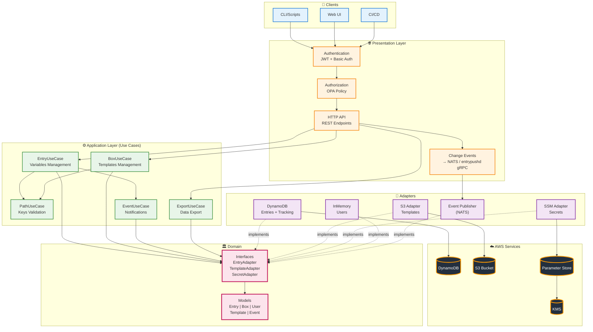
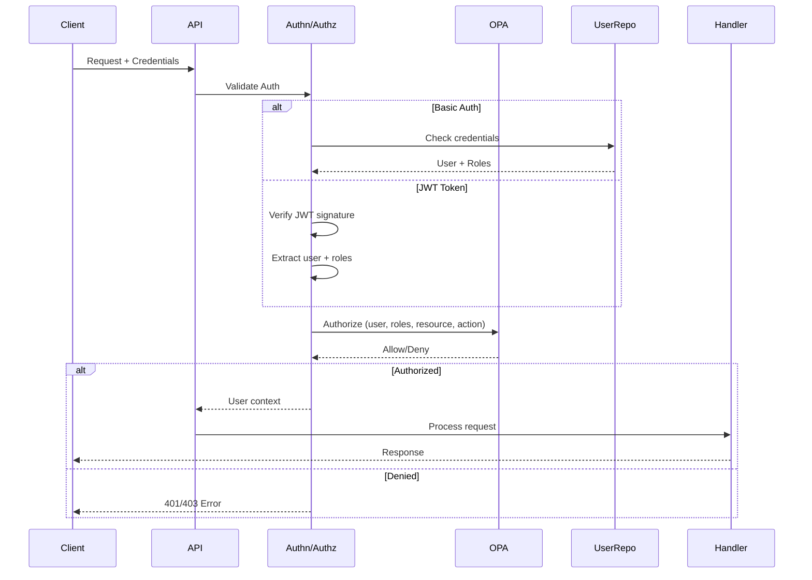
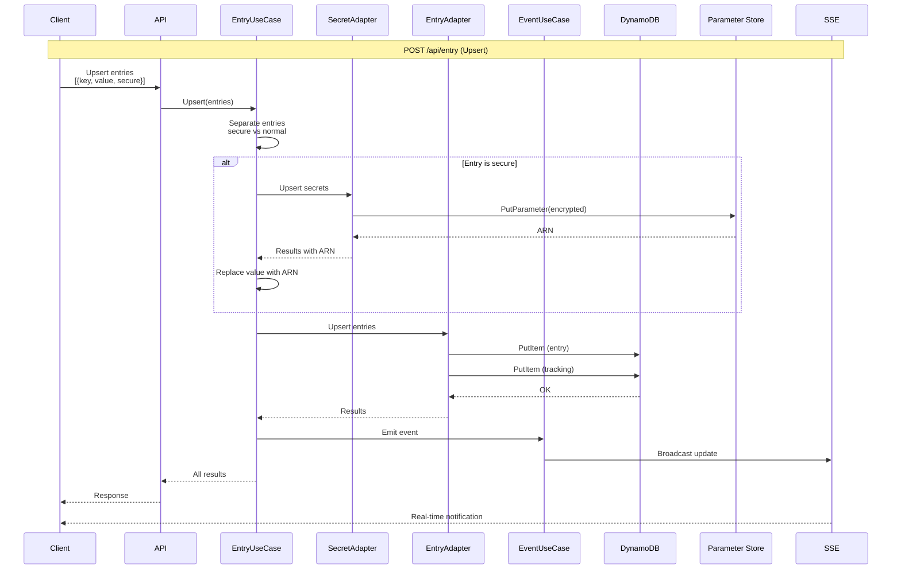
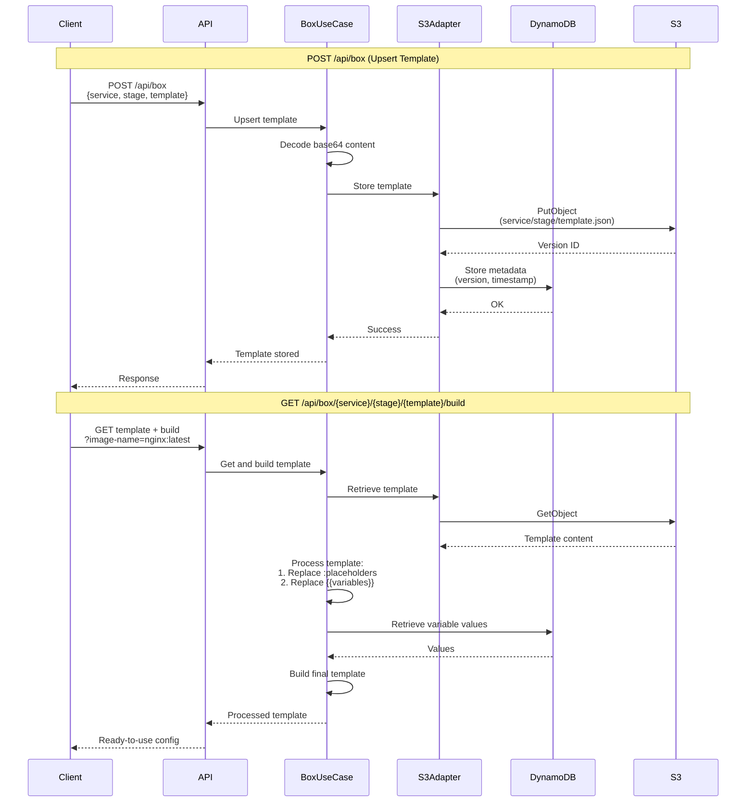
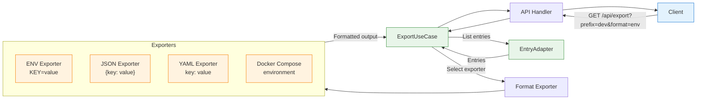
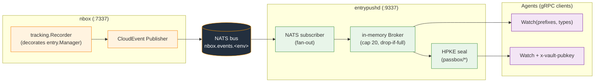
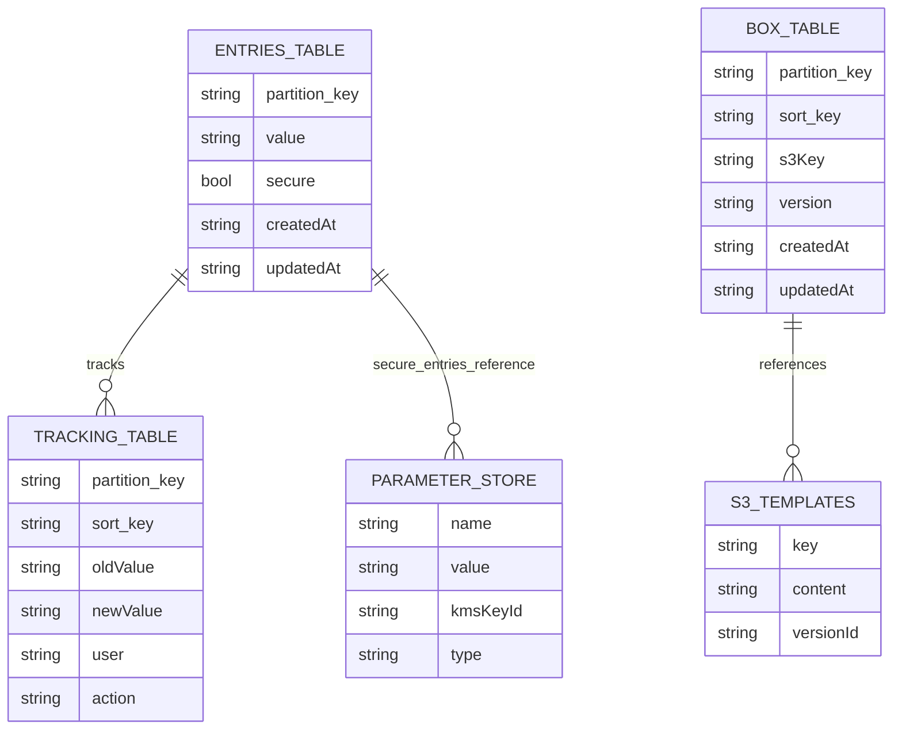
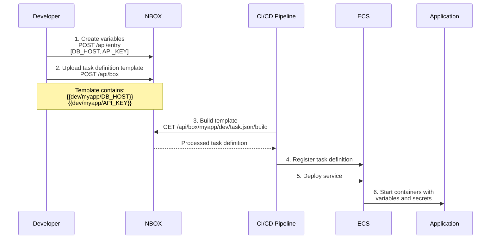
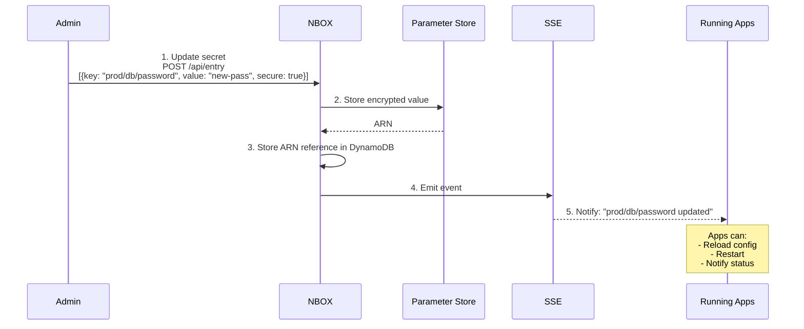
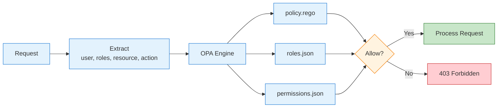

# NBOX Architecture Diagram

## Overview

NBOX is a backend platform for centralized management of configurations, environment variables, and secrets. It uses hexagonal architecture (ports and adapters) with native AWS integration, and adds a real-time change-streaming plane for agents plus a *vault* (passbox) mode where values are encrypted at rest and delivered end-to-end encrypted.

### Binaries

| Binary | Role | Listener |
|---|---|---|
| **nbox** (`cmd/nbox`) | Core HTTP REST API: entries, templates (box), prefix routing, auth (JWT). Wired with Uber `fx`. | HTTP `:7337` |
| **entrypushd** (`cmd/entrypushd`) | Real-time push daemon: subscribes to the NATS event bus and fans changes out to agents over a gRPC `Watch` stream. M2M auth (AppRole / AWS-STS). For `passbox/*` (vault) entries it delivers the value HPKE-sealed to the agent's key. | gRPC `:9337` |
| **nbox-cli** (`cmd/cli`, Cobra) | Admin CLI (`nbox-cli`): manages the dynamic-config table — prefix routing and auth entities (users, AppRole, AWS-STS). | — |

### External dependencies

- **AWS**: DynamoDB (entries index + metadata + tracking + dynamic config), S3 (templates), Parameter Store + KMS (secrets), STS (M2M identity & audit).
- **NATS**: event bus (subject `nbox.events.<env>`) connecting nbox (publisher) to every entrypushd instance (fan-out subscriber).

---

## General Architecture

---

## Authentication and Authorization Flow

**Available Roles** (`policies/authz/roles.json`). Rego resolves the caller's roles into a union of permission patterns (regex over `METHOD:/path`); default-deny.

| Role | Description |
|---|---|
| `anonymous` | Public access only (health). |
| `authenticated` | Implicit pseudo-role injected by `policy.rego` for **every** authenticated caller (K8s `system:authenticated` style) — grants `platform:read:metadata`; never assigned to users. |
| `viewer` | Read-only non-production entries/templates + tracking. |
| `viewer_prod` | Read-only including production (key/prefix/export/lookup). |
| `editor` | Read+write entries and templates (+ boxspec validate). |
| `secrets_reader` | Read plaintext secret values (non-vault). |
| `maintainer` | Delete entries. |
| `cicd` | CI/CD: read templates+entries, build, CUE validate, bulk lookup, resolve non-vault secrets. |
| `entrypushd` | Service account for the entrypushd binary: read prefixes/leaves/lookup + `secrets:read:value:vault`. |
| `vault_reader` | Read vault (passbox) index + resolve its secret values + vault tracking — human counterpart of `entrypushd`. |
| `vault_operator` | `vault_reader` + `entries:write`. |
| `template_editor_nonprod` | Read all templates; create/update only non-prod stages; CUE validate. |
| `secrets_reader_nonprod` | Resolve plaintext for every root except beta/production/dr. |
| `templates_publisher` | Full template ops (read, write any stage, build, vars, validate). |
| `templates_publisher_nonprod` | Read all; write only non-prod; build/vars/validate. |
| `templates_viewer` | Read-only templates (list, detail, build, vars). |
| `entries_editor` | Create/update + read entries one level (no leaves/lookup). |
| `entries_reader` | Read all index records: key, prefix, lookup, export (no plaintext, no leaves). |
| `entries_reader_nonprod` | Read index records for development/qa/sandbox/global + history. |
| `entries_maintainer` | Delete entries (and subtree). |
| `security_auditor` | Read EVERYTHING incl. vault plaintext + history — zero writes. |
| `admin` | Full system access (`admin:full_access`). |

**M2M service accounts** authenticate with AppRole or AWS-STS (see *M2M Authentication* below) and receive these same roles inside a short-lived JWT.

---

## Variables Management Flow (Entries)

**Available Operations:**
- `POST /api/entry`: Create/update variables
- `GET /api/entry/prefix?v=<path>[&leaves]`: List by prefix (one level; `leaves` = flat subtree of every real key)
- `GET /api/entry/key?v=<key>`: Get specific variable (index record)
- `GET /api/entry/resolve?v=<key>`: Resolve plaintext secret value
- `GET /api/entry/secret-value?v=<key>`: Deprecated alias of `/api/entry/resolve`
- `POST /api/entry/lookup`: Batch-resolve many keys (JSON body list)
- `GET /api/entry/export?prefix=<path>&format=<fmt>`: Export configuration
- `DELETE /api/entry/key?v=<key>`: Delete variable
- `GET /api/track/key?v=<key>&from=&to=&limit=`: Change history (time window)

---

## Templates Management Flow

**Available Operations:**
- `POST /api/box/{service}/{stage}/{template}`: Create/update template (path-addressed, V2)
- `POST /api/box`: **Deprecated** form-body upsert (superseded by V2; admin-only)
- `GET /api/box`: List all templates (grouped and **ordered by service**)
- `GET /api/box/{service}/{stage}`: Stage detail (templates in a stage)
- `GET /api/box/{service}/{stage}/{template}`: Get raw template
- `HEAD /api/box/{service}/{stage}/{template}`: Check existence
- `GET /api/box/{service}/{stage}/{template}/build`: Get processed template
- `GET /api/box/{service}/{stage}/{template}/vars`: List variables a template references
- `GET /api/box/schemas`: List available schema types
- `GET /api/boxspec/specs` · `GET /api/boxspec/resolve?pattern=` · `POST /api/boxspec/validate` · `POST /api/boxspec/reload`: CUE spec catalog, JSON-Schema export, server-side validation, reload

**Template Processing:**
1. Placeholders `:variable` - Replaced with query params
2. Variables `{{global/example/var}}` - Replaced with values from DynamoDB/SSM

---

## Export Flow

**Supported Formats:**
- `env`: Environment variables (.env)
- `json`: JSON format
- `yaml`: YAML format
- `docker-compose`: For docker-compose.yml

---

## Real-time Change Streaming (NATS → entrypushd → gRPC)

Real-time delivery is **not** SSE/HTTP. nbox publishes change events to a **NATS** bus; **every** `entrypushd` instance subscribes (empty queue group ⇒ fan-out — all instances get all events) and forwards matching events to agents over the gRPC `stream.v1.KVStream/Watch` server-stream.

**Event flow:**
- Event types (CloudEvents): `nbox.entry.upserted`, `nbox.entry.deleted` (entrypushd forwards these two). Subject = the entry key; extension `prefix` = top path segment.
- `Watch(prefixes[], types[])` filter: OR within each list, AND across the two; `*`-suffix wildcard on types; empty list = match-all. Per-subscriber buffered channel (cap 20), drop-if-full so a slow agent never blocks the bus.
- **Snapshot-on-connect** (`ENTRYPUSHD_NBOX_URL` set + prefixes given): before streaming deltas, entrypushd fetches current state via `GET /api/entry/prefix?v=<pfx>&leaves=true` and replays it as `EntryUpserted` bursts — no gap, subscription registered first. Fail-closed (`Unavailable`) on fetch error.

---

## M2M Authentication (entrypushd)

Agents authenticate to the gRPC stream via one of two Vault-style M2M schemes; both mint the **same** short-lived JWT (TTL **15 min**, `aud=["nbox","entrypushd"]`, signed with the shared `HMAC_SECRET_KEY`).

- **AppRole** — `authorization: AppRole <base64(JSON{role_id, secret_id})>`. bcrypt-matched against the config store; supports per-hash `ExpiresAt`, `allowed_cidrs`, zero-downtime secret rotation.
- **AWS-STS** — `authorization: AWS-STS <base64(JSON{presigned GetCallerIdentity})>`. entrypushd forwards it to STS (anti-SSRF host allowlist), matches the returned ARN against `arn_map`.

**Hardening:** kill switch `NBOX_APPROLE_DISABLED=true` (→ `Unavailable`); CIDR restrictions; **sentinel collapse** (all credential failures → `Unauthenticated "invalid credentials"`, no oracle); audit logs record `role_id`/scheme/source_ip/rpc_method/success — never the `secret_id`.

---

## Vault (passbox) — encrypted at rest & in transit

A prefix is *vault* through three real mechanisms (there is no `isVault` field):
1. **prefix-config** routes `passbox` writes to `parameterstore_secure` → forces `secure=true` (KMS-encrypted), never stored as plain text.
2. **entrypushd** hardcodes `vaultPrefix = "passbox/"` (`isVaultKey`).
3. **OPA** gates it with `*:vault` permissions matching `v=passbox…`.

**Key format:** `/passbox/[stage/]<service>/<secret>`. Required tags `stage_name`, `updated_by`; max 10 tags.

**HPKE delivery (RFC 9180, X25519/HKDF-SHA256/AES-256-GCM):** when a `Watch` agent presents `x-vault-pubkey` + `x-vault-instance-nonce`, entrypushd resolves the plaintext (`GET /api/entry/resolve`) and **seals it to the agent's ephemeral key** instead of masking — ciphertext in `Event.Data`, `Extensions{encrypted:hpke, suite_id, key_fpr}`. Plaintext exists only transiently in entrypushd RAM; never logged or persisted. Fail-closed. A non-forgeable `client_id = H(subject‖nonce‖pubkey_fpr)` is derived for audit.

---

## Data Storage

---

## Use Cases

### Application Deployment with ECS

### Secrets Rotation

---

## Storage Backends & Prefix Routing

Each entry is routed to a storage backend by **longest-prefix-match (LPM)** over the prefix-config, combined with the entry's `secure` flag (`internal/entry/store/gateway.go`).

- Backends: `dynamodb` (also the global **index**), `parameterstore`, `parameterstore_secure` (forces KMS).
- Per-prefix `Config` has `TypeDefault` and `TypeSecure`; `resolveBackend(key, secure)` picks `TypeSecure` when the entry is secure, else `TypeDefault`. LPM is an immutable in-memory map rebuilt on each config refresh — no DynamoDB round-trip per resolve.
- The DynamoDB **index** always holds the metadata record (stamped with `StorageBackend` + SHA-256 `Fingerprint`); the real value lives in the routed backend. `Resolve` reads the index then fetches the value from the named backend. For secure entries the index value is a pointer/ARN, never plaintext.
- Inspect routing at runtime: `GET /api/prefix` (list), `GET /api/prefix/backends`, `GET /api/prefix/resolve?v=<key>` (LPM resolution).

## Dynamic Configuration (hot-reload)

`NBOX_BASIC_AUTH_CREDENTIALS`, `NBOX_APPROLE_ROLES`, `NBOX_AWS_ARN_MAP` and prefix routing resolve via an **env-first, then-DynamoDB** chain (`internal/config/`). One config table (`NBOX_CONFIG_TABLE_NAME`, key `kind`+`id`) holds four kinds:

| kind | Managed by | Purpose |
|---|---|---|
| `basic_auth` | `nbox-cli config user` | HTTP Basic Auth users (bcrypt) |
| `app_role` | `nbox-cli config approle` | AppRole M2M credentials |
| `arn_map` | `nbox-cli config aws-sts` | AWS-STS ARN → roles |
| `prefix_config` | `nbox-cli prefix` | storage routing per prefix |

If the env var is set it **wins** and is static (restart to change). The DynamoDB path uses a TTL cache (`NBOX_CONFIG_TTL`, default 45s) with background refresh, atomic swap, and **fail-closed** startup. Changes propagate to all replicas within one TTL; `NBOX_APPROLE_DISABLED` is the immediate revocation kill switch. Every write stamps `updated_by` with the caller's AWS ARN (`sts:GetCallerIdentity`).

## Admin CLI (`nbox-cli`)

Cobra CLI that writes the dynamic-config table without restarts. Two command groups:

- **`prefix`** — `upsert` / `list` / `rm` storage-routing configs (`--prefix`, `--type`, `--secure`, `--allowed`).
- **`config`** — three subgroups, each `upsert`/`list`/`rm` (+ approle `generate`/`rotate-secret`):
  - `config user` — basic-auth users (`--username`, `--password` → bcrypt, `--roles`, `--status`).
  - `config aws-sts` — ARN mappings (`--arn`, `--roles`).
  - `config approle` — `generate` (mints `role_id`+`secret_id`), `rotate-secret` (appends a new hash, zero-downtime), `--cidrs`.
- **`--emit-env`** (on every write command): print the `export NBOX_XXX=…` line for local dev instead of touching DynamoDB.

---

## Key Components

### Configuration (Config)
- Loaded from environment variables
- Support for multiple credential strategies
- Configurable environment prefixes

### Path Use Case
- Key validation
- Path normalization
- Allowed prefixes control

### Event System
- Decorator pattern for use cases
- Multi-channel publishing
- SSE support for Web UI

### Health Checks
- AWS connectivity verification
- S3, DynamoDB, SSM status
- Endpoints `/health`, `/status`, `/ready` (public whitelist)

---

## Security

### Security Layers

1. **Authentication**: HTTP Basic Auth or JWT
2. **Authorization**: OPA (Open Policy Agent) with role-based policies. Platform metadata endpoints (stages, `me/permissions`, prefix, schemas, boxspec) are no longer in the public whitelist — they require authentication and are granted via the implicit `authenticated` pseudo-role (`platform:read:metadata`). The public whitelist keeps only health checks, `POST /api/auth/token`, and Swagger.
3. **Encryption**:
   - Secrets encrypted in Parameter Store with KMS
   - TLS in transit (deployment configuration)
4. **Auditing**: Change tracking in DynamoDB table

### OPA Authorization Flow

---

## Endpoints Summary

### Public (no auth — whitelist)
- `GET /health` · `GET /status` · `GET /ready` - Health / liveness / readiness
- `POST /api/auth/token` - Basic Auth → JWT (24h)
- `GET|POST /swagger/` - Swagger UI

### Platform metadata (requires auth via `authenticated`)
- `GET /api/static/stages` - Valid stages
- `GET /api/me/permissions` - Caller's granted permissions (UI hints)
- `GET /api/prefix` · `GET /api/prefix/backends` · `GET /api/prefix/resolve?v=<key>` - Prefix routing

### Entries (Variables)
- `POST /api/entry` - Create/update variables
- `GET /api/entry/prefix?v=<path>[&leaves]` - List by prefix (one level / flat subtree)
- `GET /api/entry/key?v=<key>` - Get variable (index record)
- `GET /api/entry/resolve?v=<key>` - Resolve secret (plaintext)
- `GET /api/entry/secret-value?v=<key>` - Deprecated alias of `/api/entry/resolve`
- `POST /api/entry/lookup` - Batch-resolve many keys
- `GET /api/entry/export?prefix=<path>&format=<fmt>` - Export configuration
- `DELETE /api/entry/key?v=<key>` - Delete variable
- `GET /api/track/key?v=<key>&from=&to=&limit=` - Change history

### Box (Templates) & Specs
- `POST /api/box/{service}/{stage}/{template}` - Create/update template (V2)
- `POST /api/box` - Deprecated form-body upsert (admin-only)
- `GET /api/box` - List all templates (ordered by service)
- `GET /api/box/{service}/{stage}` - Stage detail
- `GET|HEAD /api/box/{service}/{stage}/{template}` - Get / check template
- `GET /api/box/{service}/{stage}/{template}/build` - Processed template
- `GET /api/box/{service}/{stage}/{template}/vars` - Template variables
- `GET /api/box/schemas` - Schema types
- `GET /api/boxspec/specs` · `GET /api/boxspec/resolve?pattern=` · `POST /api/boxspec/validate` · `POST /api/boxspec/reload` - CUE specs

### gRPC (entrypushd, :9337)
- `stream.v1.KVStream/Watch` - Server-streaming change subscription. Requires `authorization: AppRole|AWS-STS <base64…>` metadata. Vault values HPKE-sealed when `x-vault-pubkey` is presented.

---

## Technologies Used

- **Language**: Go 1.26
- **DI**: Uber FX
- **HTTP**: Native net/http (Go 1.22 method-prefixed ServeMux)
- **gRPC**: `stream.v1.KVStream` (entrypushd) + reflection
- **Event bus**: NATS (core, fan-out)
- **AWS SDK**: aws-sdk-go-v2 (DynamoDB, S3, SSM/Parameter Store, KMS, STS)
- **AuthN**: JWT (HS256) for humans; AppRole & AWS-STS M2M for agents; bcrypt password/secret hashing
- **AuthZ**: OPA (Open Policy Agent) — Rego policies
- **Crypto**: HPKE (RFC 9180, X25519/HKDF-SHA256/AES-256-GCM) for vault delivery
- **Templates**: CUE spec validation
- **Logger**: Zap (structured logging)
- **CLI**: Cobra
- **Swagger**: OpenAPI documentation
- **Testing**: Go standard testing

